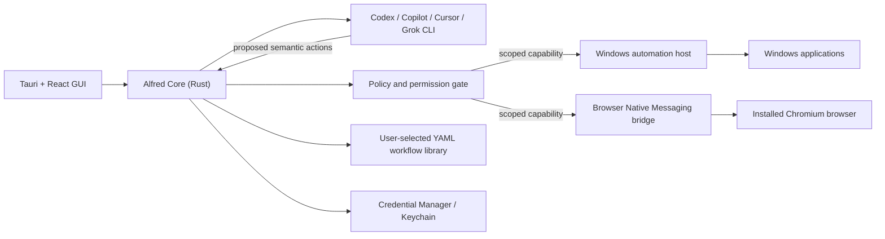

# Alfred

Alfred is a local-first desktop workflow agent for repetitive work across applications and installed browsers. A user describes a goal, selects an installed AI CLI as the planner, performs or refines the workflow, and saves the result as a reusable YAML file or a scheduled automation.

> [!IMPORTANT]
> Alfred is an early, Windows-first prototype. It is suitable for development and controlled testing, not production or unattended use with important data. Windows native automation still needs the clean-VM release matrix, code signing, and installer validation described in [Windows testing](docs/WINDOWS-TESTING.md). The macOS UI and core run from source, but the macOS native automation host is not implemented yet.

## Design goals

- A polished GUI for setup, workflow creation, live execution, permissions, credentials, and schedules.
- Visible execution with a current-action timeline, screenshots, pause, stop, takeover, and checkpoint recovery.
- Pluggable planning through installed Codex, GitHub Copilot, Cursor, or Grok CLIs.
- Semantic control of Windows applications through UI Automation, screen capture, and narrowly scoped keyboard/mouse input.
- Control of the user's installed Chromium browser through an unpacked extension and Native Messaging bridge.
- Local, portable workflow files that users can keep in Documents, OneDrive, Dropbox, Git, or any folder they choose.
- A non-configurable hard block on deletion, trash, purge, destructive overwrite, password-field typing, and similar persistent-data-loss actions.

## Current status

| Area | Status |
| --- | --- |
| Tauri/React desktop GUI and first-run setup | Implemented; builds on Windows and macOS |
| Rust policy engine, permissions, OS vault, events, and checkpoints | Implemented with policy tests |
| Windows UI Automation, `PrintWindow` capture, and targeted `SendInput` host | Implemented with foreground enforcement, window-bounds validation, and a virtual-key allow-list; clean Windows 11 desktop validation is pending |
| Chromium extension and Native Messaging bridge | Implemented as an unpacked extension with per-run tab pinning; packaged install validation is pending |
| Codex, Copilot, Cursor, and Grok CLI adapters | Beta; requires the selected CLI to be installed and authenticated |
| Goal runs (live planner loop with policy gate, approvals, and guardrails) | Implemented; provider answer parsing is best-effort per CLI and needs the Windows validation pass |
| Planner vision (per-turn screenshots to the CLI) | Implemented for Codex (`--image`), Copilot (`--attachment`), Grok and Cursor (prompt-listed file paths); opt-in setting, off by default |
| Workflow YAML recording, replay, pause/stop, and recovery | Implemented with per-step app re-resolution, retries, timeouts, a single-run lock, wait/expect state conditions, cross-app variables, and mid-run approval prompts; full cross-application validation is pending |
| Scheduling | Implemented in the core; Windows Task Scheduler validation is pending |
| Windows MSI/NSIS packaging | Build scripts and CI are present; installers are unsigned and pre-release |
| macOS native application control and screen capture | Not implemented; Swift host contract only |

## Architecture



The provider CLI is a planner, not an executor. It never receives direct access to keyboard, pointer, UI Automation, screen-capture, browser Native Messaging, or filesystem mutation APIs. Every action is validated by Alfred Core before a short-lived capability is sent to a native executor. See [Architecture](docs/ARCHITECTURE.md) for the trust boundary.

## Prerequisites

### Windows 11 (primary platform)

- [Node.js](https://nodejs.org/) 20 or newer
- [Rust stable](https://rustup.rs/) with the MSVC toolchain
- [.NET 10 SDK](https://dotnet.microsoft.com/download/dotnet/10.0)
- Visual Studio 2022 Build Tools with **Desktop development with C++**
- Microsoft Edge WebView2 Runtime (normally included with Windows 11)
- At least one supported provider CLI, installed and signed in, for real planning runs

Tauri's official [Windows prerequisites](https://v2.tauri.app/start/prerequisites/#windows) cover the required Microsoft build components.

### macOS (development preview)

- Node.js 20 or newer
- Rust stable
- Xcode Command Line Tools

The shell, GUI, policy core, workflow library, provider adapters, and Keychain integration can run on macOS. Native Mac application observation, screenshots, clicks, and typing remain blocked until the Swift host is implemented.

## Quick start

Clone the repository:

```bash
git clone https://github.com/gulshanmudgal/Alfred.git
cd Alfred
```

On Windows PowerShell:

```powershell
powershell -ExecutionPolicy Bypass -File .\alfred.ps1
```

On macOS:

```bash
chmod +x ./alfred
./alfred
```

The launcher installs JavaScript dependencies on the first run. Alfred then opens its GUI, where you choose a provider, workflow-library folder, screenshot-retention policy, and application permissions.

## Provider setup

Install and authenticate one or more supported CLIs before opening Alfred:

| Provider | Command Alfred detects |
| --- | --- |
| OpenAI Codex | `codex` |
| GitHub Copilot | `copilot` |
| Cursor | `cursor-agent` |
| Grok | `grok` |

Alfred reuses the CLI's existing sign-in by default. An optional API token can be entered in the GUI and is stored in Windows Credential Manager or macOS Keychain, never in the workflow YAML.

Provider CLI flags and authentication behavior can change between releases. Verify the adapter with a harmless planning prompt before recording a workflow.

## Installed-browser bridge (Windows)

1. Build Alfred once with `alfred.ps1`.
2. Open `edge://extensions` (or the equivalent Chrome/Brave page).
3. Enable **Developer mode**, select **Load unpacked**, and choose `browser/chromium-extension`.
4. Copy the generated extension ID.
5. Register the native host from the repository root:

```powershell
.\scripts\windows\install-browser-bridge.ps1 `
  -ExtensionId "YOUR_32_CHARACTER_EXTENSION_ID" `
  -HostPath ".\native\windows-host\bin\Debug\net10.0-windows\win-x64\alfred-windows-host.exe"
```

Restart the browser after registration. The extension supports tab listing, navigation, visible-page capture, semantic observation, clicking, and typing. It independently rejects destructive labels and password fields.

## Workflows and sharing

Workflow definitions are human-readable YAML files in the folder selected during onboarding. They contain semantic steps and required permissions, but not provider credentials, schedules, screenshots, or machine-specific run state.

To share a workflow, share or sync its YAML file through any service you trust. The recipient reviews it, places it in their own Alfred library, grants local application permissions, and performs a supervised first run. There is intentionally no marketplace or Alfred-hosted workflow cloud.

## Build and test

Cross-platform checks:

```bash
npm ci
npm run build
cargo test --manifest-path src-tauri/Cargo.toml
```

Windows host and non-desktop safety checks:

```powershell
dotnet build .\native\windows-host\Alfred.WindowsHost.csproj -c Release
.\scripts\windows\test-e2e.ps1 -SkipDesktop
```

Run the complete Windows desktop smoke test in an interactive Windows 11 session:

```powershell
.\scripts\windows\test-e2e.ps1
```

Build MSI and NSIS packages:

```powershell
.\scripts\windows\package.ps1
```

The GitHub Actions workflow repeats the source, policy, host, and packaging checks on `windows-latest`. Passing CI does not replace the interactive matrix in [Windows testing](docs/WINDOWS-TESTING.md).

## Safety model

Deletion-related decisions are hard-coded as `hard_deny` and cannot be enabled in settings. The same class of checks is repeated in Alfred Core, the Windows native host, and the browser extension. Unknown effects require the user rather than silently proceeding.

No safety layer is perfect. Keep backups, use test accounts and disposable files during development, review workflow YAML before importing it, and do not grant unattended access to irreplaceable data until the project has undergone an independent security review.

## Roadmap

- Complete the clean Windows 11 VM test matrix and retain screenshot evidence.
- Validate Edge/Chrome/Brave Native Messaging end to end.
- Validate provider authentication and cancellation for every supported CLI.
- Exercise Task Scheduler recovery and unattended runs.
- Sign and verify MSI/NSIS install, upgrade, repair, and uninstall flows.
- Implement the Swift AXUIElement/ScreenCaptureKit host for macOS parity.

## Contributing

Issues and focused pull requests are welcome. Please keep changes inside the safety architecture: provider processes may propose actions, but only Alfred Core may authorize a narrowly scoped native capability. Do not add arbitrary shell execution or configurable deletion bypasses.

## License

Alfred is released under the [MIT License](LICENSE).
